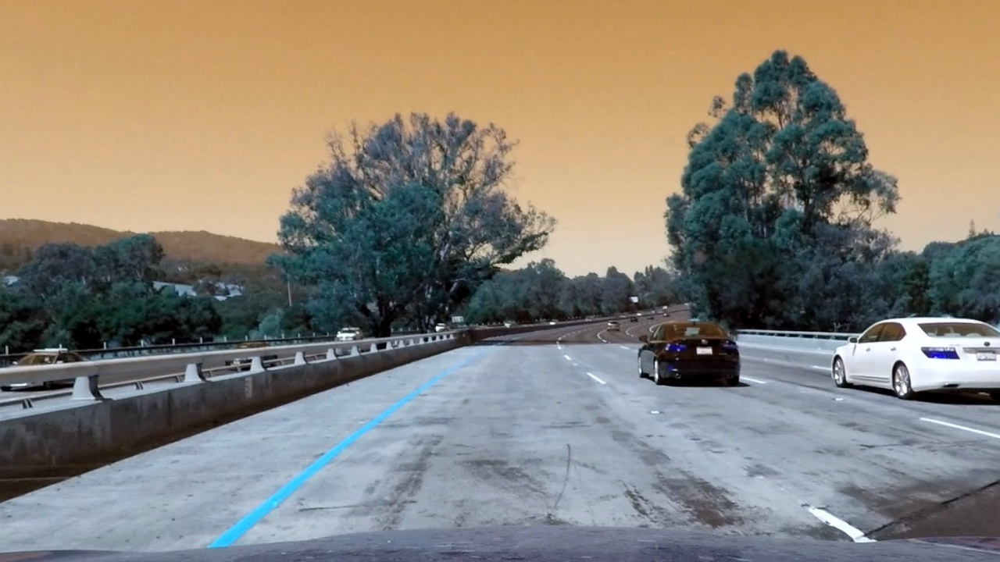
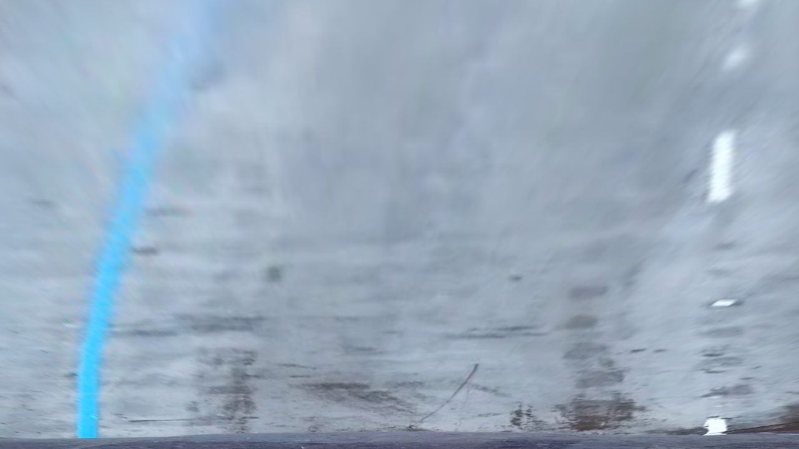
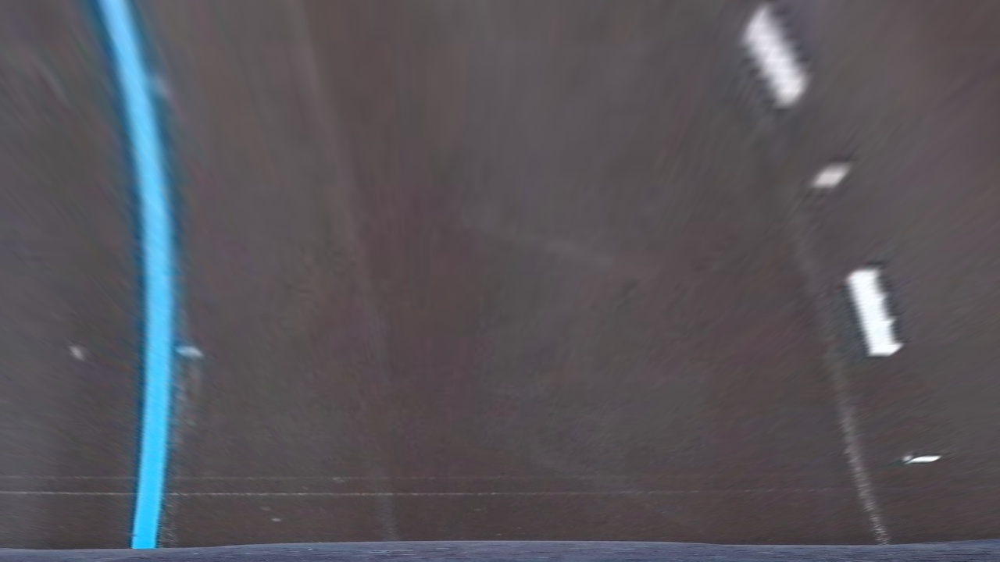
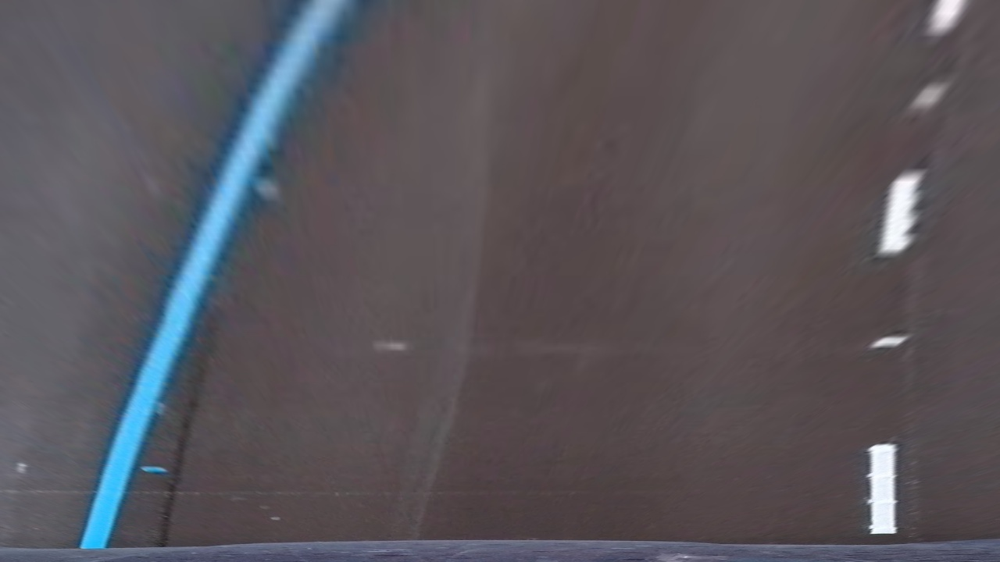
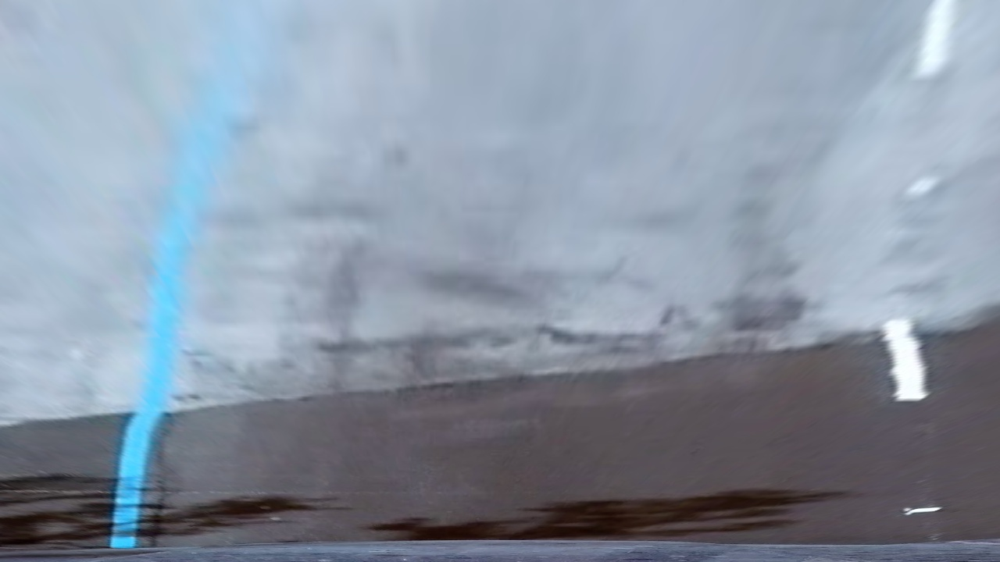
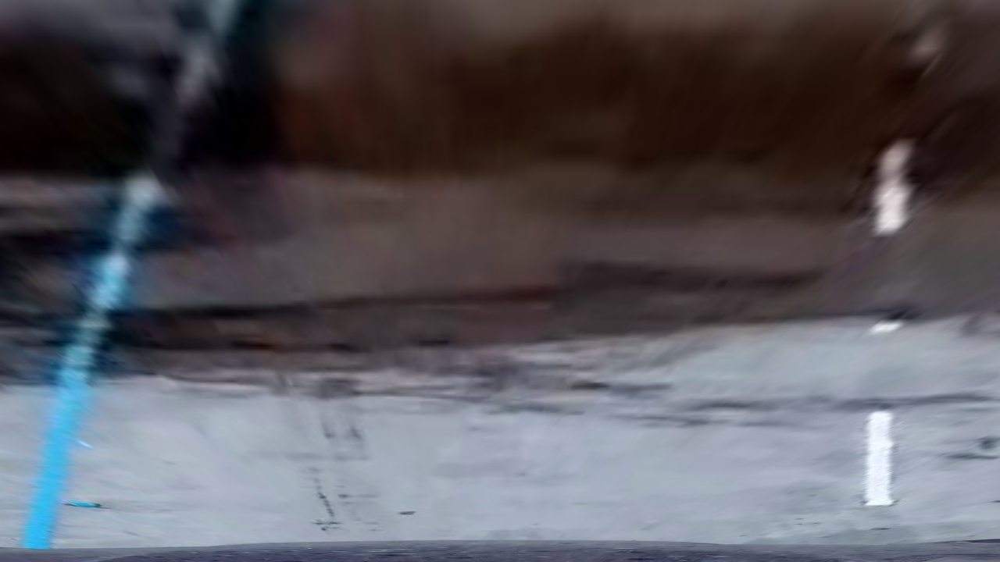
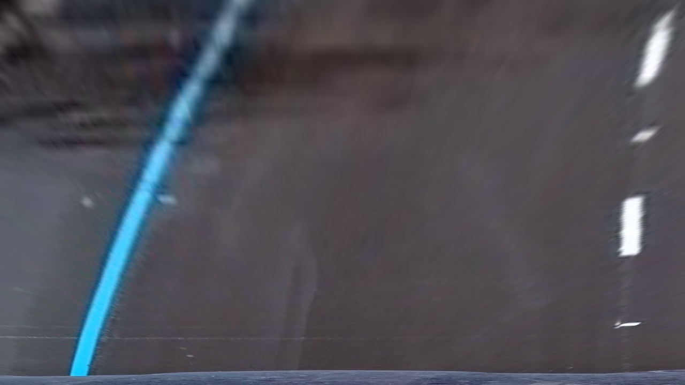
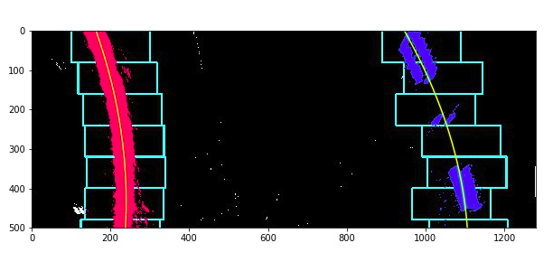
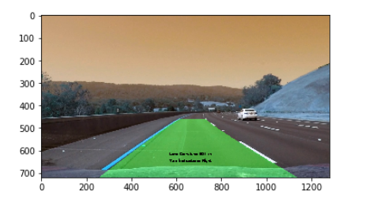

**Advanced Lane Finding Project**

The goals / steps of this project are the following:

* Compute the camera calibration matrix and distortion coefficients given a set of chessboard images.
* Apply a distortion correction to raw images.
* Use color transforms, gradients, etc., to create a thresholded binary image.
* Apply a perspective transform to rectify binary image ("birds-eye view").
* Detect lane pixels and fit to find the lane boundary.
* Determine the curvature of the lane and vehicle position with respect to center.
* Warp the detected lane boundaries back onto the original image.
* Output visual display of the lane boundaries and numerical estimation of lane curvature and vehicle position.

[//]: # (Image References)

[image1]: ./examples/undistort_output.png "Undistorted"
[image2]: ./test_images/test1.jpg "Road Transformed"
[image3]: ./examples/binary_combo_example.jpg "Binary Example"
[image4]: ./examples/warped_straight_lines.jpg "Warp Example"
[image5]: ./examples/color_fit_lines.jpg "Fit Visual"
[image6]: ./examples/example_output.jpg "Output"
[video1]: ./project_video.mp4 "Video"

---

### 1.Camera Calibration

The first step is camera calibration in order to remove the distortion effects that the camera may have. For this I utilized the code from the lectures and used the images of chessboard in calibration folder to find the distortion coefficient and camera matrix, using `cv2.calibrateCamera()` function.
 
I applied this distortion correction to the test image using the `cv2.undistort()` function and obtained this result: 

### 2. Pipeline (single images)

Using the obtained camera matrix and distortion coefficients, I applied it on one of the images in test folder, i.e on test1.jpg. I got the output as follows:

For detecting the lane lines, I used HSL colorspace and sobel gradient thresholding. Firt , using cv2.cvtColor(), I converted the image from RGB to HLS colorspace. Then, applied sobel operator in x direction on the l-channel of the hls image. In order to create a binary image with detected lanes, I thresholded the scaled sobel image using the threshold range provided in function parameter, and then performed bitwise AND operation with the binary image obtained from s-channel of hls image. Similarly, other images from test set have been processesd and saved in the output folder.

I have first extracted the image dimensions as h and w.(Height and width respectively.) Since, the relative location of lane lines remains almost same with respect to the camera, I choose following source and destination points.

| Source        | Destination   | 
|:-------------:|:-------------:| 
| 550, 460      | 0, 0          | 
| 740, 460      | w, 0          |
| 1280, 720     | w, h          |
| 128, 720      | 0, h          |

Below, is the example of the perspective transform applied on each one of the test images.

In order to decide what pixels are categorized as left and right lane pixels, I have used histogram as suggested in lecture videos as well. Thus, I took the histogram of lower half of image, and used sliding window technique to assign the pixels as left lane pixels and right lane pixels. Most of the approach and code has been refereed from the code provided in quizzes during lectures of Advanced Computer Vision.

Refer to the figure below for the lane candidates detection and sliding window visulaization.

It is done inside the get_polynomial() function in cell 9. As explained in the theory, the idea is to fit a second order polynomial curve to the detected lane pixels in the image. For lane center, we simply take the average of l_fit_x_int and r_fir_x_int , which denote the curves for lanes. 

And, car center position is simply taken as half of the image width. But since the camera could not be mounted everytime on the center, the center offset value for the car can be calculated by using folowing formula: (car_center_pos - lane_center_pos) * x_unit_pix / 10.

However, we need to take into account the meters in actual represented in the image pixels(thus we need y_unit_pix and x_unit_pix), which denote the meters per pixel in y and x direction respectively.

Once, the lane pixels and turns have been detected, next step is to use inverse perspective transform to superimpose the results back to the original image. And finally, use cv2.fillPoly() function for marking/coloring the detected lane in each frame of the video. 

---

### 3. Output

The lane detection looks like this:

Here is the complete output video.[output_video](https://drive.google.com/file/d/1KqQtUv21EjZvvFewS4Iu2v2kIGH_uAZ8/view?usp=sharing)

---

### Discussion rearding problems faced:

I faced a lot of problem in detecting the lane lines for challenge video.There is difficulty specifically in the lanes under bridge and shadow of the trees. This is because the hue(underlying) color is hard to detect with colorspaces in such case, and gradient thresholding detects the wall boundries under bridge and the walls between the lanes on highway. If one particular value of threshold works for one frame, it doesn't perform well similarly on other frames of the video where such challenging scenario might appear.

Hence, for my lane detection pipeline, I was able to do perfect lane detection for project_video.mp4, somewhat good lane detection for challenge_video.mp4. For challenge video, I had to select other threshold ranges as compared to previous one, hence I have included the code for challenge video in other notebook file named Advance_Lane_detection-Challenge.ipynb. 

